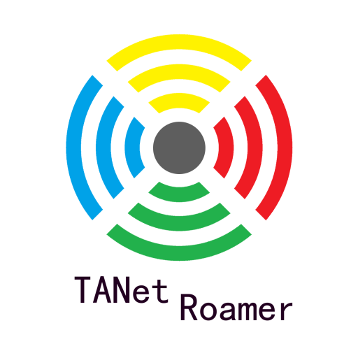

# TANet Roamer 校園網路漫遊器

[](https://github.com/ALiangLiang/TANetRoamer-android/releases/latest "最新版本")
[](https://github.com/ALiangLiang/TANetRoamer-android/blob/master/LICENSE "MIT開源協議")



以最方便的操作流程，取得全台灣的 TANetRoaming WIFI 的漫遊認證。

目前需要各校同學的協助，讓大家都可以省下輸入帳號密碼的時間。協助請參考[開發](#開發 "開發")。

## 使用說明

#### 下載與安裝

目前快速開發中，尚未正式發布，僅於 Alpha 公測，隨時有 crash 的可能性，若遇到 bug，歡迎提報或 PR。

[](https://play.google.com/store/apps/details?id=org.aliangliang.tanetroamer "前往 Google Play 商店下載")

#### 設定

安裝完後，開啟 APP，選擇所在的校園，並輸入帳號密碼，APP 會自動儲存您的設定與帳密。

可以設定三種帳號，校園帳號、校園信箱與 iTaiwan，iTaiwan 帳號不一定能在每個單位使用，詳細支援請查閱 [TANet 漫遊中心](https://roamingcenter.tanet.edu.tw/?page_id=2033)。

#### 自動登入

只要設定完成，每次連上 TANet Roaming 就會自動登入，完全無須手動操作。

## 特色

- 全自動登入。
- 記憶多種帳號密碼 (校園帳號、校園信箱、iTaiwan)。
- 設定的帳號無法登入時，自動以其他種類帳號嘗試登入。

## 支援學校 與 貢獻者

- 國立彰化師範大學 - ALiangLiang
- 國立中興大學 - ALiangLiang
- 國立中央大學 - ALiangLiang
- 國立中正大學 - BePsvPT (2016/11/13)
- 逢甲大學 - vongola12324 (2016/11/15)
- (其他校園待測試)

特別感謝核心程式碼由 DanSnow 撰寫

## 開發

### [app/src/main/res/raw/units.json](https://github.com/TANet-Roamer/units)

這個檔案是各校的設定檔，id 與 name 都已經準備好，就只差 url 與 data，url 為各校 WIFI 登入的 API 網址，data 則是傳送給 API 的資料，其中值為 %u 與 %p 的皆會被使用者設定的帳號與密碼取代。

 若有學校的登入流程複雜或特殊，請[開 issue](issue/new) 討論是否更改程式結構。

```javascript
[{
  "id" : "0015", // 學校代碼，依照 https://ulist.moe.gov.tw/ 公布資訊為主
  "name" : "國立彰化師範大學", // 學校名稱
  "realm": "mail.ncue.edu.tw", // realm，通常為學生信箱網域。
  "url" : "http://securelogin.arubanetworks.com/auth/index.html/u", // 登入 API 網址，有可能視學校而有所不同。
  "data" : { // 送 API 的資料，視學校 API 而有所不同，此為彰師大設定。
    "user_foo" : "%u", // 值為 '%u'，指的是帳號
    "password_foo" : "%p", // 值為 '%p'，指的是密碼
    "foo" : "bar",
    "foo2" : "bar2"
  }
}]
```

### TODO

- [ ] 增加測試 scripts。
- [ ] 憑證驗證，防止偽造 WIFI 熱點。

## 聲明

非[TANet無線網路漫遊交換中心](https://roamingcenter.tanet.edu.tw/)製作，為學生自行發起的開源專案。
